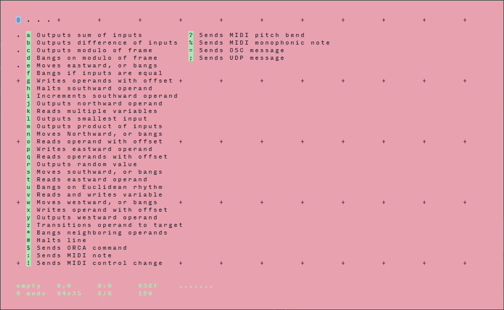
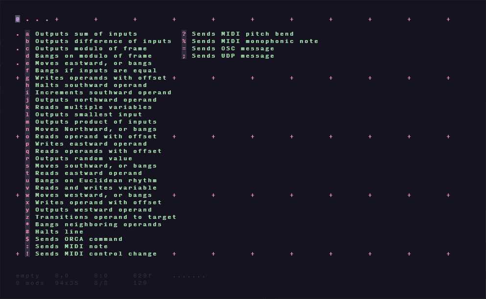
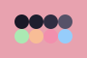
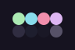

<h3 align="center">
	 
	
	🐇 Catppuccin theme for the HundredRabbits ecosystem
	
</h3>

  
  

	
	
	

&nbsp;

	Catppuccin is a community-driven pastel theme that aims to be the middle ground between low and high contrast themes. It consists of a soothing warm palette with 22 eye-candy colors perfect for coding, designing, and much more!

&nbsp;

  
  

&nbsp;

### 🐇 About HundredRabbits
Hundred Rabbits is a small artist collective. Together, they explore the planned failability of modern technology at the bounds of the hyper-connected world. They research and test low-tech solutions and document our findings with the hope of building a more resilient future.

Find out more [here](https://100r.co/site/home.html).

&nbsp;

### 🧠 Catppuccin Design Philosophy

-   **Colorful is better than colorless**: the colorfulness of something contributes to the distinction amongst the parts of that _something_, making it marginally easier to understand how things are structured.
-   **There should be balance**: not too dull, not too bright. Suitability under various light conditions is a most.
-   **Harmony is superior to dissonance**: vivacious colors must complement each other.

- Themes have been tested against the HundredRabbits theme test [tool](https://hundredrabbits.github.io/Themes/), balanced to ensure maximum compatability and aesthetic.

&nbsp;

### 🎨 Palette

#### ☀️ Morning

#### 🌑 Night

&nbsp;

### 🖌️ Usage / Installation

- Simply download the SVG files, and drag and drop them onto the application window, to install them.
- For more info and ways to apply the themes to other applications, visit the HundredRabbits theme [page](https://github.com/hundredrabbits/Themes).

| Tested programs |
|:---:|
| [ORCA](https://100r.co/site/orca.html) |

&nbsp;

### 📜 License

Catppuccin is released under the MIT license, which grants the following permissions:

-   Commercial use
-   Distribution
-   Modification
-   Private use

For more convoluted language, see the [LICENSE](https://github.com/catppuccin/catppuccin/blob/main/LICENSE).

&nbsp;

## 💝 Thanks to

- Made with ❤️ by [Cutwell](https://github.com/Cutwell)

&nbsp;

